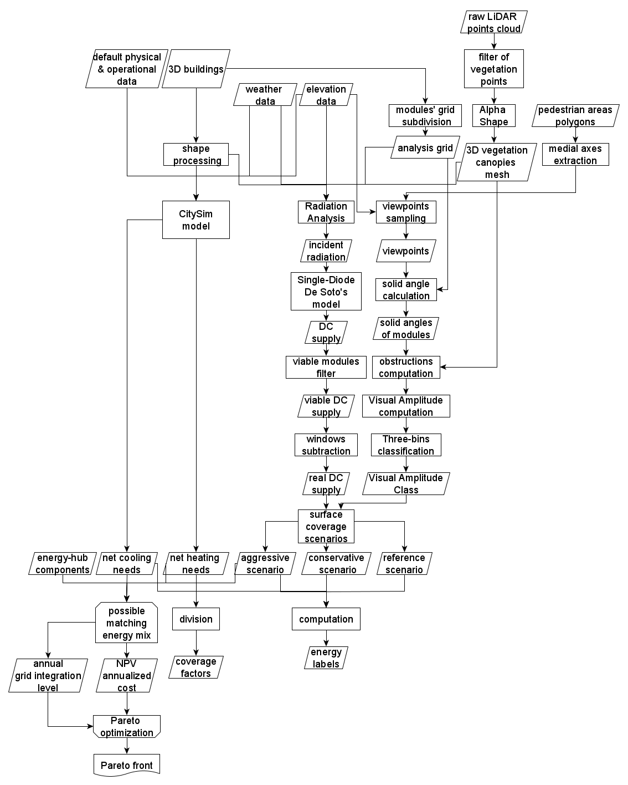

# SolViz

## Purpose
This code takes data from Honeybee pickled files containing solar hourly energy generation per each module and extracts statistics, 3D graphs, plots, etc.

## Source input
* a pickled dataframe containing hourly data for solar production of each module on building envelopes, obtained by tassellation of built surface. Such data can be obtained, given a 3D geometry input, via a [Honeybee](https://www.ladybug.tools/honeybee.html) Radiance+Daysim based workflow in [Rhino Grasshopper](https://www.grasshopper3d.com/), such as [this one](http://hydrashare.github.io/hydra/viewer?owner=mostaphaRoudsari&fork=hydra_1&id=Honeybee_Annual_Daylight_Simulation_Example&slide=0&scale=1&offset=0,0). The dataframe should look like this (shape: 8760 x n):

| datetime            |   0 |   1 |   2 |   3 |   4 |
|---------------------|-----|-----|-----|-----|-----|
| 2005-01-01 05:05:00 |   0 |   0 |   0 |   0 |   0 |
| 2005-01-01 06:05:00 |   0 |   0 |   0 |   0 |   0 |
| 2005-01-01 07:05:00 |   0 |   0 |   0 |   0 |   0 |
| 2005-01-01 08:05:00 |   1 |   1 |   1 |   1 |   1 |
| 2005-01-01 09:05:00 |  10 |  10 |  10 |  10 |  15 |
| 2005-01-01 10:05:00 |  13 |  13 |  13 |  13 |  62 |
| 2005-01-01 11:05:00 |  23 |  23 |  23 |  23 |  46 |
| 2005-01-01 12:05:00 |  12 |  12 |  12 |  12 |  12 |
| 2005-01-01 13:05:00 |  11 |  11 |  11 |  11 |  11 |
| 2005-01-01 14:05:00 |   9 |   9 |   9 |   9 |   8 |

* a dataframe containing the coordinates of each module's vertices (1st vert, 2nd vert, 3rd vert, 4th vert, 1st vert to close the polyline), and the index of the building, row, position in a row it belongs to. Such data can be obtained from [Rhino Grasshopper](https://www.grasshopper3d.com/) opportune manipulation. The dataframe should look like this (shape: n x 7):

|    |   BLDGID |   SRFID |   ROWID |   PANELID | PANELCOORDINATES                                                                                                                                                | ROOF T/F   |
|----|----------|---------|---------|-----------|-----------------------------------------------------------------------------------------------------------------------------------------------------------------|------------|
|  0 |  1013643 |       0 |       2 |         0 | -20.215867 31.742712 429.776565 -20.758787 30.561514 429.779312 -20.031812 30.228196 430.134322 -19.488892 31.409395 430.131575 -20.215867 31.742712 429.776565 | True       |
|  1 |  1013643 |       0 |       2 |         1 | -20.942841 32.076031 429.421584 -21.485762 30.894832 429.424331 -20.758787 30.561515 429.779342 -20.215867 31.742713 429.776595 -20.942841 32.076031 429.421584 | True       |
|  2 |  1013643 |       0 |       3 |         0 | -20.758788 30.561514 429.779342 -21.301708 29.380315 429.782089 -20.574733 29.046998 430.137099 -20.031813 30.228197 430.134352 -20.758788 30.561514 429.779342 | True       |
|  3 |  1013643 |       0 |       3 |         1 | -21.485764 30.894833 429.4243 -22.028684 29.713634 429.427047 -21.30171 29.380317 429.782058 -20.75879 30.561515 429.779311 -21.485764 30.894833 429.4243       | True       |
|  4 |  1013643 |       1 |       1 |         0 | -19.10557 28.377467 429.602967 -18.562648 29.558665 429.60022 -19.271384 29.885347 429.995942 -19.814307 28.704149 429.99869 -19.10557 28.377467 429.602967     | True       |

## Output
[click](vertragus.github.io/SolViz/docs/interact.html)

## Requirements
Python 3.x with the following libraries:
* numpy
* pandas
* geopandas
* matplotlib.pyplot
* seaborn
* plotly
* descartes
